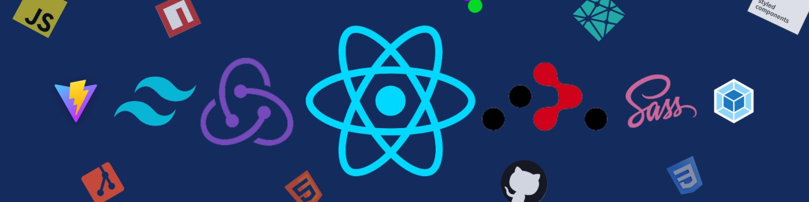

<h1 align="center">Hello! I'm Muhammad Hussain Shamim</h1>
<h3 align="center">Passionate Front-End Developer</h3>

  

---

### 👋 About Me
Hey there! I'm **Muhammad Hussain Shamim**, a passionate front-end web developer with a love for creating beautiful and functional websites. At just 16 years old, I've already immersed myself in modern technologies like **HTML, CSS, JavaScript, Firebase, Bootstrap**, and **Tailwind CSS**. My coding journey began at a young age, and I'm always on the lookout for new technologies and challenges to enhance my skills.

- 🌱 I’m currently learning **React Native**.
- 🔭 I’m working on **Software Div**.
- 🤝 Looking for help with my **Sasta Biryani project**.
- 💬 Ask me about **JavaScript, Bootstrap**.
- ⚡ Fun fact: **I code with coffee!**

---

### 🛠️ Technologies & Tools

Here are some of the tools and technologies I've worked with:

  
  
  
  
  
  
  
  
  
  
  
  
  

---

### 📈 GitHub Stats

  

  

---

### 🌐 Connect with Me

  
  
  
  

