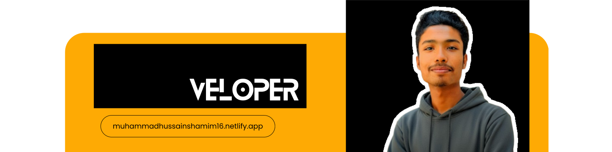

<h1 align="center">👋 Assalam-o-Alaikum, I'm Muhammad Hussain Shamim</h1>
<h3 align="center">🚀 Frontend Developer | React • WordPress • Shopify</h3>

  Passionate about building fast, responsive, and user-focused web applications.

---

## 👨‍💻 About Me

I’m a **Front-End Web Developer** with hands-on experience in building modern, scalable, and high-performance web applications.

💡 I mainly work with:
- **React.js & JavaScript**
- **WordPress & Shopify**
- **Modern UI frameworks & APIs**

Over the years, I’ve worked on a variety of real-world projects including:

- ✅ Custom **CMS platforms**
- ✅ **CRM (Customer Relationship Management)** systems
- ✅ **LMS / Lead Management** applications
- ✅ **Dynamic E-Commerce** websites

I strongly focus on:
- ⚡ Performance optimization  
- 🎨 Clean & intuitive UI/UX  
- 🧱 Scalable and maintainable code  

📚 I’m always learning new technologies and improving my skills.  
🤝 **Let’s connect, collaborate, and grow together!**

---

## 🛠️ Tech Stack & Tools

  
  
  
  
  
  
  
  
  
  
  
  

---

## 📈 What I’m Currently Doing

- 🔭 Working on **frontend-heavy real-world projects**
- 🌱 Improving skills in **advanced React & performance optimization**
- 🧠 Exploring **clean architecture & best practices**

---

## 📫 Connect With Me

- 💼 GitHub: [@hussainshamim16](https://github.com/hussainshamim16)
- 🌐 Portfolio: _Coming Soon_
- 💬 Always open for collaboration & learning

---

⭐ If you like my work, don’t forget to **star my repositories**!
